# Projects and dependencies analysis

This document provides a comprehensive overview of the projects and their dependencies in the context of upgrading to .NETCoreApp,Version=v10.0.

## Table of Contents

- [Executive Summary](#executive-Summary)
  - [Highlevel Metrics](#highlevel-metrics)
  - [Projects Compatibility](#projects-compatibility)
  - [Package Compatibility](#package-compatibility)
  - [API Compatibility](#api-compatibility)
- [Aggregate NuGet packages details](#aggregate-nuget-packages-details)
- [Top API Migration Challenges](#top-api-migration-challenges)
  - [Technologies and Features](#technologies-and-features)
  - [Most Frequent API Issues](#most-frequent-api-issues)
- [Projects Relationship Graph](#projects-relationship-graph)
- [Project Details](#project-details)

  - [SampleTopshelfService\SampleTopshelfService.csproj](#sampletopshelfservicesampletopshelfservicecsproj)
  - [Topshelf.Elmah\Topshelf.Elmah.csproj](#topshelfelmahtopshelfelmahcsproj)
  - [Topshelf.Extensions.Configuration.Tests\Topshelf.Extensions.Configuration.Tests.csproj](#topshelfextensionsconfigurationteststopshelfextensionsconfigurationtestscsproj)
  - [Topshelf.Extensions.Configuration\Topshelf.Extensions.Configuration.csproj](#topshelfextensionsconfigurationtopshelfextensionsconfigurationcsproj)
  - [Topshelf.Extensions.Logging\Topshelf.Extensions.Logging.csproj](#topshelfextensionsloggingtopshelfextensionsloggingcsproj)
  - [Topshelf.Log4Net\Topshelf.Log4Net.csproj](#topshelflog4nettopshelflog4netcsproj)
  - [Topshelf.NLog\Topshelf.NLog.csproj](#topshelfnlogtopshelfnlogcsproj)
  - [Topshelf.Serilog\Topshelf.Serilog.csproj](#topshelfserilogtopshelfserilogcsproj)
  - [TopShelf.ServiceInstaller\TopShelf.ServiceInstaller.csproj](#topshelfserviceinstallertopshelfserviceinstallercsproj)
  - [Topshelf.Tests\Topshelf.Tests.csproj](#topshelfteststopshelftestscsproj)
  - [Topshelf\Topshelf.csproj](#topshelftopshelfcsproj)

## Executive Summary

### Highlevel Metrics

| Metric | Count | Status |
| :--- | :---: | :--- |
| Total Projects | 11 | All require upgrade |
| Total NuGet Packages | 17 | 5 need upgrade |
| Total Code Files | 19 |  |
| Total Code Files with Incidents | 32 |  |
| Total Lines of Code | 2885 |  |
| Total Number of Issues | 364 |  |
| Estimated LOC to modify | 345+ | at least 12.0% of codebase |

### Projects Compatibility

| Project | Target Framework | Difficulty | Package Issues | API Issues | Est. LOC Impact | Description |
| :--- | :---: | :---: | :---: | :---: | :---: | :--- |
| [SampleTopshelfService\SampleTopshelfService.csproj](#sampletopshelfservicesampletopshelfservicecsproj) | net452;netcoreapp2.1 | 🟢 Low | 1 | 3 | 3+ | DotNetCoreApp, Sdk Style = True |
| [Topshelf.Elmah\Topshelf.Elmah.csproj](#topshelfelmahtopshelfelmahcsproj) | net452 | 🟢 Low | 0 | 0 |  | ClassLibrary, Sdk Style = True |
| [Topshelf.Extensions.Configuration.Tests\Topshelf.Extensions.Configuration.Tests.csproj](#topshelfextensionsconfigurationteststopshelfextensionsconfigurationtestscsproj) | net452 | 🟢 Low | 4 | 5 | 5+ | ClassLibrary, Sdk Style = True |
| [Topshelf.Extensions.Configuration\Topshelf.Extensions.Configuration.csproj](#topshelfextensionsconfigurationtopshelfextensionsconfigurationcsproj) | net452;netstandard2.0 | 🟢 Low | 0 | 0 |  | ClassLibrary, Sdk Style = True |
| [Topshelf.Extensions.Logging\Topshelf.Extensions.Logging.csproj](#topshelfextensionsloggingtopshelfextensionsloggingcsproj) | net452;netstandard2.0 | 🟢 Low | 0 | 0 |  | ClassLibrary, Sdk Style = True |
| [Topshelf.Log4Net\Topshelf.Log4Net.csproj](#topshelflog4nettopshelflog4netcsproj) | net452;netstandard2.0 | 🟢 Low | 0 | 0 |  | ClassLibrary, Sdk Style = True |
| [Topshelf.NLog\Topshelf.NLog.csproj](#topshelfnlogtopshelfnlogcsproj) | net452;netstandard2.0 | 🟢 Low | 0 | 0 |  | ClassLibrary, Sdk Style = True |
| [Topshelf.Serilog\Topshelf.Serilog.csproj](#topshelfserilogtopshelfserilogcsproj) | net452;netstandard2.0 | 🟢 Low | 0 | 0 |  | ClassLibrary, Sdk Style = True |
| [TopShelf.ServiceInstaller\TopShelf.ServiceInstaller.csproj](#topshelfserviceinstallertopshelfserviceinstallercsproj) | netstandard2.0 | 🟢 Low | 3 | 0 |  | ClassLibrary, Sdk Style = True |
| [Topshelf.Tests\Topshelf.Tests.csproj](#topshelfteststopshelftestscsproj) | net452;netcoreapp2.1 | 🟢 Low | 0 | 0 |  | ClassLibrary, Sdk Style = True |
| [Topshelf\Topshelf.csproj](#topshelftopshelfcsproj) | net452;netstandard2.0 | 🟡 Medium | 1 | 337 | 337+ | ClassLibrary, Sdk Style = True |

### Package Compatibility

| Status | Count | Percentage |
| :--- | :---: | :---: |
| ✅ Compatible | 12 | 70.6% |
| ⚠️ Incompatible | 1 | 5.9% |
| 🔄 Upgrade Recommended | 4 | 23.5% |
| ***Total NuGet Packages*** | ***17*** | ***100%*** |

### API Compatibility

| Category | Count | Impact |
| :--- | :---: | :--- |
| 🔴 Binary Incompatible | 175 | High - Require code changes |
| 🟡 Source Incompatible | 169 | Medium - Needs re-compilation and potential conflicting API error fixing |
| 🔵 Behavioral change | 1 | Low - Behavioral changes that may require testing at runtime |
| ✅ Compatible | 7002 |  |
| ***Total APIs Analyzed*** | ***7347*** |  |

## Aggregate NuGet packages details

| Package | Current Version | Suggested Version | Projects | Description |
| :--- | :---: | :---: | :--- | :--- |
| Appveyor.TestLogger | 2.0.0 |  | [Topshelf.Extensions.Configuration.Tests.csproj](#topshelfextensionsconfigurationteststopshelfextensionsconfigurationtestscsproj) [Topshelf.Tests.csproj](#topshelfteststopshelftestscsproj) | ✅Compatible |
| Elmah | 1.2.2 |  | [Topshelf.Elmah.csproj](#topshelfelmahtopshelfelmahcsproj) | ✅Compatible |
| log4net | 2.0.12 |  | [Topshelf.Log4Net.csproj](#topshelflog4nettopshelflog4netcsproj) | ✅Compatible |
| Microsoft.Extensions.Configuration.Abstractions | 1.1.2 | 10.0.3 | [Topshelf.Extensions.Configuration.Tests.csproj](#topshelfextensionsconfigurationteststopshelfextensionsconfigurationtestscsproj) | NuGet package upgrade is recommended |
| Microsoft.Extensions.Configuration.Binder | 1.1.2 | 10.0.3 | [Topshelf.Extensions.Configuration.Tests.csproj](#topshelfextensionsconfigurationteststopshelfextensionsconfigurationtestscsproj) | NuGet package upgrade is recommended |
| Microsoft.NET.Test.Sdk | 16.8.3 |  | [Topshelf.Extensions.Configuration.Tests.csproj](#topshelfextensionsconfigurationteststopshelfextensionsconfigurationtestscsproj) [Topshelf.Tests.csproj](#topshelfteststopshelftestscsproj) | ✅Compatible |
| Microsoft.SourceLink.GitHub | 1.0.0 |  | [Topshelf.csproj](#topshelftopshelfcsproj) [Topshelf.Elmah.csproj](#topshelfelmahtopshelfelmahcsproj) [Topshelf.Extensions.Configuration.csproj](#topshelfextensionsconfigurationtopshelfextensionsconfigurationcsproj) [Topshelf.Extensions.Configuration.Tests.csproj](#topshelfextensionsconfigurationteststopshelfextensionsconfigurationtestscsproj) [Topshelf.Extensions.Logging.csproj](#topshelfextensionsloggingtopshelfextensionsloggingcsproj) [Topshelf.Log4Net.csproj](#topshelflog4nettopshelflog4netcsproj) [Topshelf.NLog.csproj](#topshelfnlogtopshelfnlogcsproj) [Topshelf.Serilog.csproj](#topshelfserilogtopshelfserilogcsproj) [TopShelf.ServiceInstaller.csproj](#topshelfserviceinstallertopshelfserviceinstallercsproj) | ✅Compatible |
| Microsoft.Win32.Registry | 4.7.0 |  | [TopShelf.ServiceInstaller.csproj](#topshelfserviceinstallertopshelfserviceinstallercsproj) | NuGet package functionality is included with framework reference |
| Microsoft.Win32.SystemEvents | 4.7.0 | 10.0.3 | [TopShelf.ServiceInstaller.csproj](#topshelfserviceinstallertopshelfserviceinstallercsproj) | NuGet package upgrade is recommended |
| NETStandard.Library | 2.0.3 |  | [TopShelf.ServiceInstaller.csproj](#topshelfserviceinstallertopshelfserviceinstallercsproj) | ✅Compatible |
| NLog | 4.7.5 |  | [Topshelf.NLog.csproj](#topshelfnlogtopshelfnlogcsproj) | ✅Compatible |
| NUnit | 3.12.0 |  | [Topshelf.Extensions.Configuration.Tests.csproj](#topshelfextensionsconfigurationteststopshelfextensionsconfigurationtestscsproj) [Topshelf.Tests.csproj](#topshelfteststopshelftestscsproj) | ✅Compatible |
| NUnit3TestAdapter | 3.17.0 |  | [Topshelf.Extensions.Configuration.Tests.csproj](#topshelfextensionsconfigurationteststopshelfextensionsconfigurationtestscsproj) [Topshelf.Tests.csproj](#topshelfteststopshelftestscsproj) | ✅Compatible |
| Serilog | 2.10.0 |  | [SampleTopshelfService.csproj](#sampletopshelfservicesampletopshelfservicecsproj) [Topshelf.Serilog.csproj](#topshelfserilogtopshelfserilogcsproj) | ✅Compatible |
| Serilog.Sinks.ColoredConsole | 3.0.1 |  | [SampleTopshelfService.csproj](#sampletopshelfservicesampletopshelfservicecsproj) | ⚠️NuGet package is deprecated |
| System.Runtime.InteropServices.RuntimeInformation | 4.3.0 |  | [Topshelf.csproj](#topshelftopshelfcsproj) | NuGet package functionality is included with framework reference |
| System.ServiceProcess.ServiceController | 4.7.0 | 10.0.3 | [TopShelf.ServiceInstaller.csproj](#topshelfserviceinstallertopshelfserviceinstallercsproj) | NuGet package upgrade is recommended |

## Top API Migration Challenges

### Technologies and Features

| Technology | Issues | Percentage | Migration Path |
| :--- | :---: | :---: | :--- |
| Legacy Configuration System | 89 | 25.8% | Legacy XML-based configuration system (app.config/web.config) that has been replaced by a more flexible configuration model in .NET Core. The old system was rigid and XML-based. Migrate to Microsoft.Extensions.Configuration with JSON/environment variables; use System.Configuration.ConfigurationManager NuGet package as interim bridge if needed. |
| Configuration Installation Components | 89 | 25.8% | System.Configuration installer components for deploying applications with custom installation logic that are not available for .NET Core. The installer infrastructure has been removed. Use modern deployment tools like Windows Installer XML (WiX), InstallShield, or platform-specific package managers. |
| Code Access Security (CAS) | 1 | 0.3% | Code Access Security (CAS) APIs that were removed in .NET Core/.NET for security and performance reasons. CAS provided fine-grained security policies but proved complex and ineffective. Remove CAS usage; not supported in modern .NET. |

### Most Frequent API Issues

| API | Count | Percentage | Category |
| :--- | :---: | :---: | :--- |
| T:System.ServiceProcess.ServiceAccount | 41 | 11.9% | Binary Incompatible |
| T:System.ServiceProcess.ServiceControllerStatus | 37 | 10.7% | Source Incompatible |
| T:System.Configuration.Install.Installer | 29 | 8.4% | Binary Incompatible |
| T:System.Configuration.Install.TransactedInstaller | 14 | 4.1% | Binary Incompatible |
| P:System.ServiceProcess.ServiceController.Status | 13 | 3.8% | Source Incompatible |
| T:System.ServiceProcess.ServiceProcessInstaller | 12 | 3.5% | Binary Incompatible |
| T:System.ServiceProcess.ServiceStartMode | 12 | 3.5% | Source Incompatible |
| T:System.Configuration.Install.InstallEventHandler | 12 | 3.5% | Binary Incompatible |
| M:System.TimeSpan.FromSeconds(System.Double) | 11 | 3.2% | Source Incompatible |
| P:System.ServiceProcess.ServiceBase.ExitCode | 11 | 3.2% | Source Incompatible |
| T:System.Configuration.Install.InstallerCollection | 6 | 1.7% | Binary Incompatible |
| P:System.Configuration.Install.Installer.Installers | 6 | 1.7% | Binary Incompatible |
| M:System.TimeSpan.FromMinutes(System.Double) | 6 | 1.7% | Source Incompatible |
| T:System.ServiceProcess.ServiceController | 5 | 1.4% | Source Incompatible |
| T:System.ServiceProcess.ServiceInstaller | 5 | 1.4% | Binary Incompatible |
| F:System.ServiceProcess.ServiceAccount.User | 4 | 1.2% | Binary Incompatible |
| F:System.ServiceProcess.ServiceControllerStatus.Running | 4 | 1.2% | Source Incompatible |
| M:System.ServiceProcess.ServiceController.#ctor(System.String) | 4 | 1.2% | Source Incompatible |
| F:System.ServiceProcess.ServiceControllerStatus.Stopped | 4 | 1.2% | Source Incompatible |
| P:System.ServiceProcess.ServiceInstaller.StartType | 4 | 1.2% | Binary Incompatible |
| T:Microsoft.Win32.PowerModeChangedEventHandler | 4 | 1.2% | Source Incompatible |
| T:Microsoft.Win32.SessionSwitchEventHandler | 4 | 1.2% | Source Incompatible |
| P:System.ServiceProcess.ServiceProcessInstaller.Password | 3 | 0.9% | Binary Incompatible |
| F:System.ServiceProcess.ServiceAccount.LocalSystem | 3 | 0.9% | Binary Incompatible |
| M:System.TimeSpan.FromHours(System.Double) | 2 | 0.6% | Source Incompatible |
| M:System.ServiceProcess.ServiceBase.Stop | 2 | 0.6% | Source Incompatible |
| T:System.ServiceProcess.ServiceBase | 2 | 0.6% | Source Incompatible |
| P:System.ServiceProcess.ServiceBase.ServiceName | 2 | 0.6% | Source Incompatible |
| P:System.ServiceProcess.ServiceBase.CanHandleSessionChangeEvent | 2 | 0.6% | Source Incompatible |
| P:System.ServiceProcess.ServiceBase.CanHandlePowerEvent | 2 | 0.6% | Source Incompatible |
| P:System.ServiceProcess.ServiceBase.CanShutdown | 2 | 0.6% | Source Incompatible |
| P:System.ServiceProcess.ServiceBase.CanPauseAndContinue | 2 | 0.6% | Source Incompatible |
| M:System.ServiceProcess.ServiceBase.#ctor | 2 | 0.6% | Source Incompatible |
| P:System.ServiceProcess.ServiceProcessInstaller.Account | 2 | 0.6% | Binary Incompatible |
| P:System.ServiceProcess.ServiceProcessInstaller.Username | 2 | 0.6% | Binary Incompatible |
| M:System.ServiceProcess.ServiceController.WaitForStatus(System.ServiceProcess.ServiceControllerStatus,System.TimeSpan) | 2 | 0.6% | Source Incompatible |
| F:System.ServiceProcess.ServiceControllerStatus.Paused | 2 | 0.6% | Source Incompatible |
| F:System.ServiceProcess.ServiceStartMode.Automatic | 2 | 0.6% | Source Incompatible |
| T:System.Configuration.Install.InstallContext | 2 | 0.6% | Binary Incompatible |
| F:System.ServiceProcess.ServiceAccount.LocalService | 2 | 0.6% | Binary Incompatible |
| M:System.Configuration.Install.InstallerCollection.AddRange(System.Configuration.Install.Installer[]) | 2 | 0.6% | Binary Incompatible |
| M:System.Configuration.Install.Installer.#ctor | 2 | 0.6% | Binary Incompatible |
| E:Microsoft.Win32.SystemEvents.PowerModeChanged | 2 | 0.6% | Source Incompatible |
| E:Microsoft.Win32.SystemEvents.SessionSwitch | 2 | 0.6% | Source Incompatible |
| M:System.Exception.#ctor(System.Runtime.Serialization.SerializationInfo,System.Runtime.Serialization.StreamingContext) | 2 | 0.6% | Source Incompatible |
| T:System.Security.Permissions.SecurityPermissionAttribute | 1 | 0.3% | Source Incompatible |
| M:System.TimeSpan.FromDays(System.Double) | 1 | 0.3% | Source Incompatible |
| M:System.ServiceProcess.ServiceBase.Dispose(System.Boolean) | 1 | 0.3% | Source Incompatible |
| T:System.ServiceProcess.PowerBroadcastStatus | 1 | 0.3% | Source Incompatible |
| T:System.ServiceProcess.SessionChangeDescription | 1 | 0.3% | Source Incompatible |

## Projects Relationship Graph

Legend:
📦 SDK-style project
⚙️ Classic project

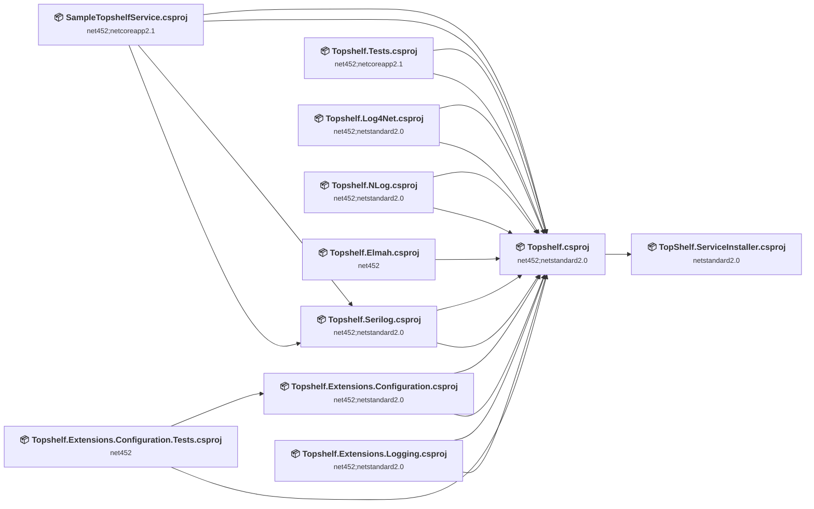

## Project Details

### SampleTopshelfService\SampleTopshelfService.csproj

#### Project Info

- **Current Target Framework:** net452;netcoreapp2.1
- **Proposed Target Framework:** net452;netcoreapp2.1;net10.0-windows
- **SDK-style**: True
- **Project Kind:** DotNetCoreApp
- **Dependencies**: 4
- **Dependants**: 0
- **Number of Files**: 0
- **Number of Files with Incidents**: 3
- **Lines of Code**: 0
- **Estimated LOC to modify**: 3+ (at least 0.0% of the project)

#### Dependency Graph

Legend:
📦 SDK-style project
⚙️ Classic project

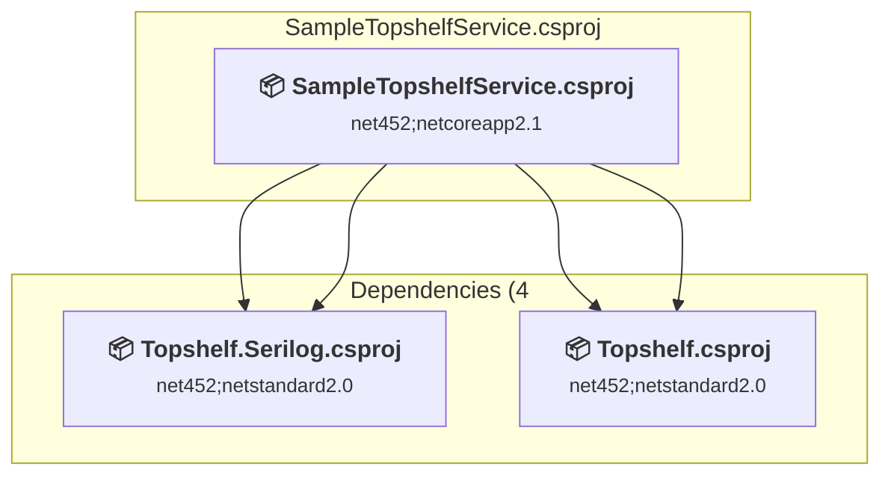

### API Compatibility

| Category | Count | Impact |
| :--- | :---: | :--- |
| 🔴 Binary Incompatible | 0 | High - Require code changes |
| 🟡 Source Incompatible | 3 | Medium - Needs re-compilation and potential conflicting API error fixing |
| 🔵 Behavioral change | 0 | Low - Behavioral changes that may require testing at runtime |
| ✅ Compatible | 86 |  |
| ***Total APIs Analyzed*** | ***89*** |  |

### Topshelf.Elmah\Topshelf.Elmah.csproj

#### Project Info

- **Current Target Framework:** net452
- **Proposed Target Framework:** net10.0-windows
- **SDK-style**: True
- **Project Kind:** ClassLibrary
- **Dependencies**: 1
- **Dependants**: 0
- **Number of Files**: 0
- **Number of Files with Incidents**: 1
- **Lines of Code**: 0
- **Estimated LOC to modify**: 0+ (at least 0.0% of the project)

#### Dependency Graph

Legend:
📦 SDK-style project
⚙️ Classic project

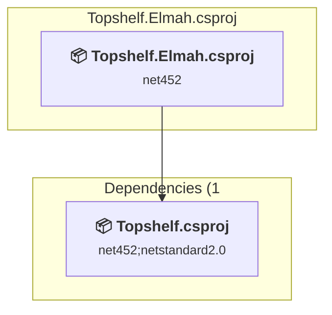

### API Compatibility

| Category | Count | Impact |
| :--- | :---: | :--- |
| 🔴 Binary Incompatible | 0 | High - Require code changes |
| 🟡 Source Incompatible | 0 | Medium - Needs re-compilation and potential conflicting API error fixing |
| 🔵 Behavioral change | 0 | Low - Behavioral changes that may require testing at runtime |
| ✅ Compatible | 256 |  |
| ***Total APIs Analyzed*** | ***256*** |  |

### Topshelf.Extensions.Configuration.Tests\Topshelf.Extensions.Configuration.Tests.csproj

#### Project Info

- **Current Target Framework:** net452
- **Proposed Target Framework:** net10.0-windows
- **SDK-style**: True
- **Project Kind:** ClassLibrary
- **Dependencies**: 2
- **Dependants**: 0
- **Number of Files**: 0
- **Number of Files with Incidents**: 2
- **Lines of Code**: 0
- **Estimated LOC to modify**: 5+ (at least 0.0% of the project)

#### Dependency Graph

Legend:
📦 SDK-style project
⚙️ Classic project

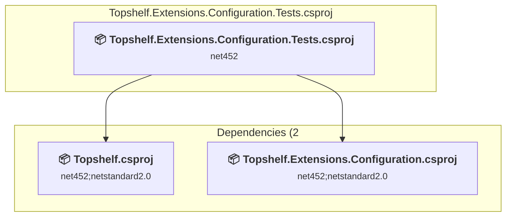

### API Compatibility

| Category | Count | Impact |
| :--- | :---: | :--- |
| 🔴 Binary Incompatible | 0 | High - Require code changes |
| 🟡 Source Incompatible | 5 | Medium - Needs re-compilation and potential conflicting API error fixing |
| 🔵 Behavioral change | 0 | Low - Behavioral changes that may require testing at runtime |
| ✅ Compatible | 200 |  |
| ***Total APIs Analyzed*** | ***205*** |  |

### Topshelf.Extensions.Configuration\Topshelf.Extensions.Configuration.csproj

#### Project Info

- **Current Target Framework:** net452;netstandard2.0
- **Proposed Target Framework:** net452;netstandard2.0;net10.0-windows
- **SDK-style**: True
- **Project Kind:** ClassLibrary
- **Dependencies**: 2
- **Dependants**: 1
- **Number of Files**: 0
- **Number of Files with Incidents**: 1
- **Lines of Code**: 0
- **Estimated LOC to modify**: 0+ (at least 0.0% of the project)

#### Dependency Graph

Legend:
📦 SDK-style project
⚙️ Classic project

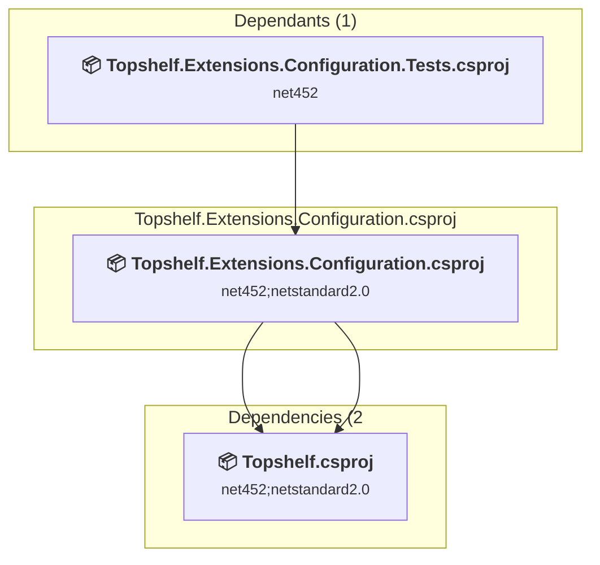

### API Compatibility

| Category | Count | Impact |
| :--- | :---: | :--- |
| 🔴 Binary Incompatible | 0 | High - Require code changes |
| 🟡 Source Incompatible | 0 | Medium - Needs re-compilation and potential conflicting API error fixing |
| 🔵 Behavioral change | 0 | Low - Behavioral changes that may require testing at runtime |
| ✅ Compatible | 119 |  |
| ***Total APIs Analyzed*** | ***119*** |  |

### Topshelf.Extensions.Logging\Topshelf.Extensions.Logging.csproj

#### Project Info

- **Current Target Framework:** net452;netstandard2.0
- **Proposed Target Framework:** net452;netstandard2.0;net10.0-windows
- **SDK-style**: True
- **Project Kind:** ClassLibrary
- **Dependencies**: 2
- **Dependants**: 0
- **Number of Files**: 0
- **Number of Files with Incidents**: 1
- **Lines of Code**: 0
- **Estimated LOC to modify**: 0+ (at least 0.0% of the project)

#### Dependency Graph

Legend:
📦 SDK-style project
⚙️ Classic project

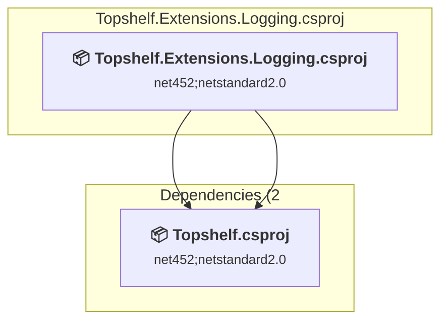

### API Compatibility

| Category | Count | Impact |
| :--- | :---: | :--- |
| 🔴 Binary Incompatible | 0 | High - Require code changes |
| 🟡 Source Incompatible | 0 | Medium - Needs re-compilation and potential conflicting API error fixing |
| 🔵 Behavioral change | 0 | Low - Behavioral changes that may require testing at runtime |
| ✅ Compatible | 138 |  |
| ***Total APIs Analyzed*** | ***138*** |  |

### Topshelf.Log4Net\Topshelf.Log4Net.csproj

#### Project Info

- **Current Target Framework:** net452;netstandard2.0
- **Proposed Target Framework:** net452;netstandard2.0;net10.0-windows
- **SDK-style**: True
- **Project Kind:** ClassLibrary
- **Dependencies**: 2
- **Dependants**: 0
- **Number of Files**: 0
- **Number of Files with Incidents**: 1
- **Lines of Code**: 0
- **Estimated LOC to modify**: 0+ (at least 0.0% of the project)

#### Dependency Graph

Legend:
📦 SDK-style project
⚙️ Classic project

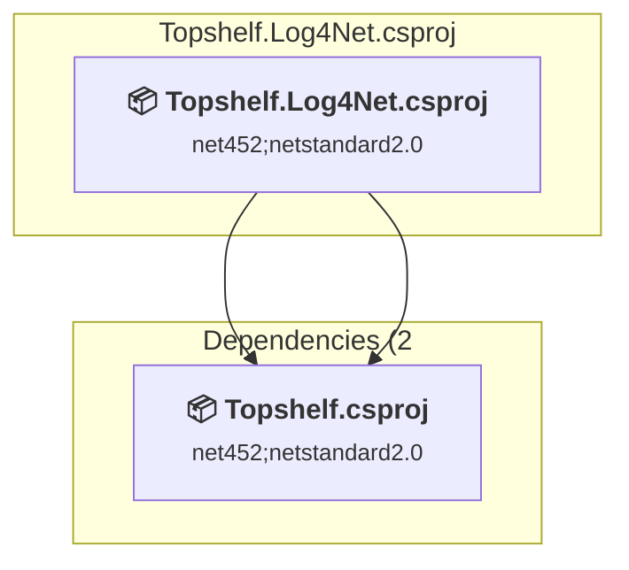

### API Compatibility

| Category | Count | Impact |
| :--- | :---: | :--- |
| 🔴 Binary Incompatible | 0 | High - Require code changes |
| 🟡 Source Incompatible | 0 | Medium - Needs re-compilation and potential conflicting API error fixing |
| 🔵 Behavioral change | 0 | Low - Behavioral changes that may require testing at runtime |
| ✅ Compatible | 154 |  |
| ***Total APIs Analyzed*** | ***154*** |  |

### Topshelf.NLog\Topshelf.NLog.csproj

#### Project Info

- **Current Target Framework:** net452;netstandard2.0
- **Proposed Target Framework:** net452;netstandard2.0;net10.0-windows
- **SDK-style**: True
- **Project Kind:** ClassLibrary
- **Dependencies**: 2
- **Dependants**: 0
- **Number of Files**: 0
- **Number of Files with Incidents**: 1
- **Lines of Code**: 0
- **Estimated LOC to modify**: 0+ (at least 0.0% of the project)

#### Dependency Graph

Legend:
📦 SDK-style project
⚙️ Classic project

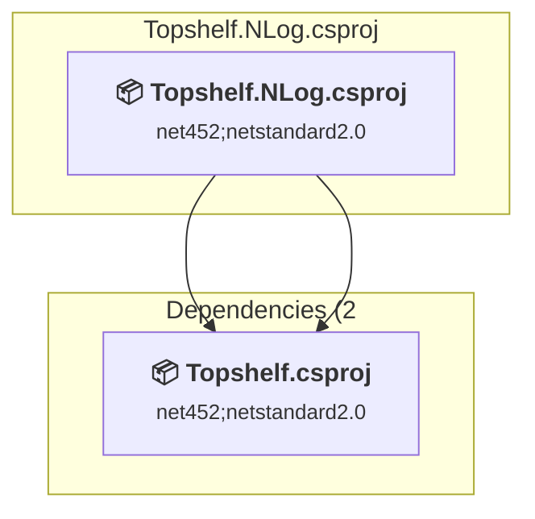

### API Compatibility

| Category | Count | Impact |
| :--- | :---: | :--- |
| 🔴 Binary Incompatible | 0 | High - Require code changes |
| 🟡 Source Incompatible | 0 | Medium - Needs re-compilation and potential conflicting API error fixing |
| 🔵 Behavioral change | 0 | Low - Behavioral changes that may require testing at runtime |
| ✅ Compatible | 130 |  |
| ***Total APIs Analyzed*** | ***130*** |  |

### Topshelf.Serilog\Topshelf.Serilog.csproj

#### Project Info

- **Current Target Framework:** net452;netstandard2.0
- **Proposed Target Framework:** net452;netstandard2.0;net10.0-windows
- **SDK-style**: True
- **Project Kind:** ClassLibrary
- **Dependencies**: 2
- **Dependants**: 1
- **Number of Files**: 0
- **Number of Files with Incidents**: 1
- **Lines of Code**: 0
- **Estimated LOC to modify**: 0+ (at least 0.0% of the project)

#### Dependency Graph

Legend:
📦 SDK-style project
⚙️ Classic project

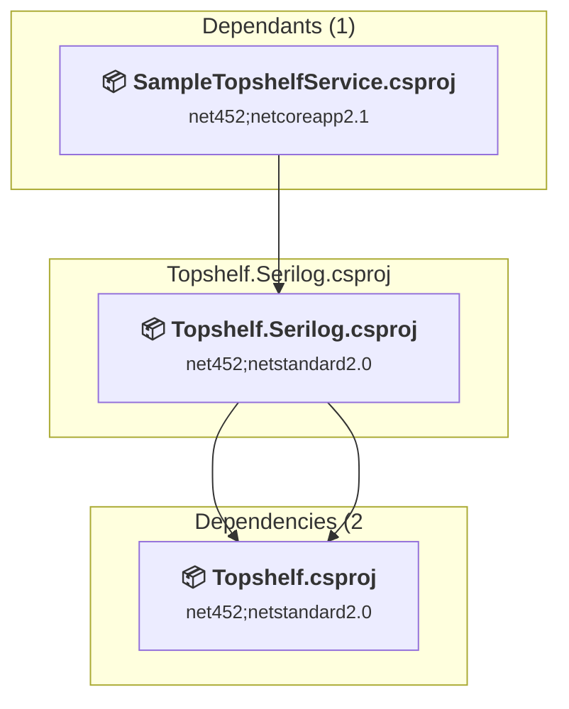

### API Compatibility

| Category | Count | Impact |
| :--- | :---: | :--- |
| 🔴 Binary Incompatible | 0 | High - Require code changes |
| 🟡 Source Incompatible | 0 | Medium - Needs re-compilation and potential conflicting API error fixing |
| 🔵 Behavioral change | 0 | Low - Behavioral changes that may require testing at runtime |
| ✅ Compatible | 156 |  |
| ***Total APIs Analyzed*** | ***156*** |  |

### TopShelf.ServiceInstaller\TopShelf.ServiceInstaller.csproj

#### Project Info

- **Current Target Framework:** netstandard2.0✅
- **SDK-style**: True
- **Project Kind:** ClassLibrary
- **Dependencies**: 0
- **Dependants**: 1
- **Number of Files**: 21
- **Number of Files with Incidents**: 1
- **Lines of Code**: 2885
- **Estimated LOC to modify**: 0+ (at least 0.0% of the project)

#### Dependency Graph

Legend:
📦 SDK-style project
⚙️ Classic project

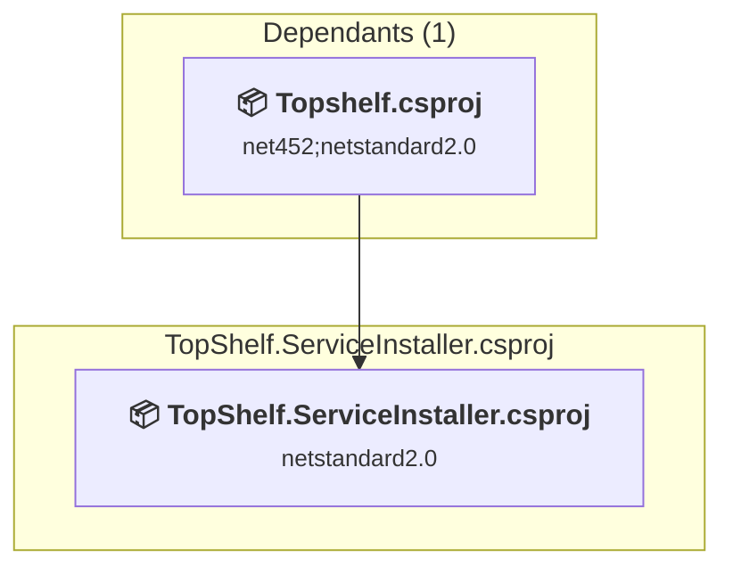

### API Compatibility

| Category | Count | Impact |
| :--- | :---: | :--- |
| 🔴 Binary Incompatible | 0 | High - Require code changes |
| 🟡 Source Incompatible | 0 | Medium - Needs re-compilation and potential conflicting API error fixing |
| 🔵 Behavioral change | 0 | Low - Behavioral changes that may require testing at runtime |
| ✅ Compatible | 0 |  |
| ***Total APIs Analyzed*** | ***0*** |  |

### Topshelf.Tests\Topshelf.Tests.csproj

#### Project Info

- **Current Target Framework:** net452;netcoreapp2.1
- **Proposed Target Framework:** net452;netcoreapp2.1;net10.0-windows
- **SDK-style**: True
- **Project Kind:** ClassLibrary
- **Dependencies**: 2
- **Dependants**: 0
- **Number of Files**: 0
- **Number of Files with Incidents**: 1
- **Lines of Code**: 0
- **Estimated LOC to modify**: 0+ (at least 0.0% of the project)

#### Dependency Graph

Legend:
📦 SDK-style project
⚙️ Classic project

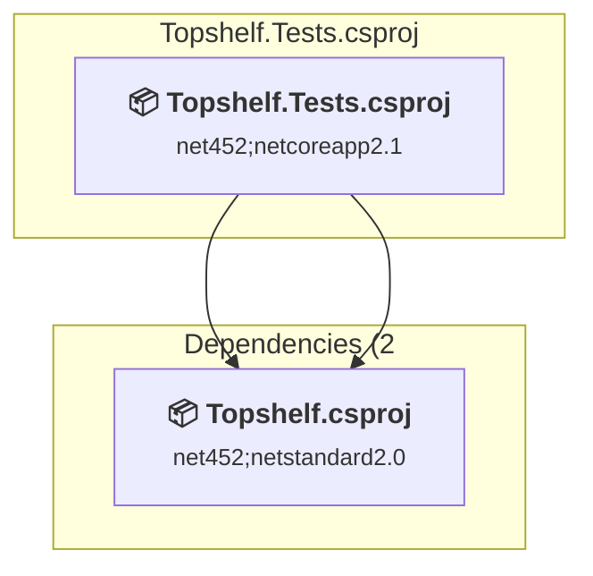

### API Compatibility

| Category | Count | Impact |
| :--- | :---: | :--- |
| 🔴 Binary Incompatible | 0 | High - Require code changes |
| 🟡 Source Incompatible | 0 | Medium - Needs re-compilation and potential conflicting API error fixing |
| 🔵 Behavioral change | 0 | Low - Behavioral changes that may require testing at runtime |
| ✅ Compatible | 139 |  |
| ***Total APIs Analyzed*** | ***139*** |  |

### Topshelf\Topshelf.csproj

#### Project Info

- **Current Target Framework:** net452;netstandard2.0
- **Proposed Target Framework:** net452;netstandard2.0;net10.0-windows
- **SDK-style**: True
- **Project Kind:** ClassLibrary
- **Dependencies**: 1
- **Dependants**: 9
- **Number of Files**: 1
- **Number of Files with Incidents**: 19
- **Lines of Code**: 0
- **Estimated LOC to modify**: 337+ (at least 0.0% of the project)

#### Dependency Graph

Legend:
📦 SDK-style project
⚙️ Classic project

```mermaid
flowchart TB
    subgraph upstream["Dependants (9)"]
        P2["<b>📦&nbsp;SampleTopshelfService.csproj</b><br/><small>net452;netcoreapp2.1</small>"]
        P3["<b>📦&nbsp;Topshelf.Tests.csproj</b><br/><small>net452;netcoreapp2.1</small>"]
        P4["<b>📦&nbsp;Topshelf.Log4Net.csproj</b><br/><small>net452;netstandard2.0</small>"]
        P5["<b>📦&nbsp;Topshelf.NLog.csproj</b><br/><small>net452;netstandard2.0</small>"]
        P6["<b>📦&nbsp;Topshelf.Elmah.csproj</b><br/><small>net452</small>"]
        P7["<b>📦&nbsp;Topshelf.Serilog.csproj</b><br/><small>net452;netstandard2.0</small>"]
        P8["<b>📦&nbsp;Topshelf.Extensions.Configuration.csproj</b><br/><small>net452;netstandard2.0</small>"]
        P9["<b>📦&nbsp;Topshelf.Extensions.Logging.csproj</b><br/><small>net452;netstandard2.0</small>"]
        P10["<b>📦&nbsp;Topshelf.Extensions.Configuration.Tests.csproj</b><br/><small>net452</small>"]
        click P2 "#sampletopshelfservicesampletopshelfservicecsproj"
        click P3 "#topshelfteststopshelftestscsproj"
        click P4 "#topshelflog4nettopshelflog4netcsproj"
        click P5 "#topshelfnlogtopshelfnlogcsproj"
        click P6 "#topshelfelmahtopshelfelmahcsproj"
        click P7 "#topshelfserilogtopshelfserilogcsproj"
        click P8 "#topshelfextensionsconfigurationtopshelfextensionsconfigurationcsproj"
        click P9 "#topshelfextensionsloggingtopshelfextensionsloggingcsproj"
        click P10 "#topshelfextensionsconfigurationteststopshelfextensionsconfigurationtestscsproj"
    end
    subgraph current["Topshelf.csproj"]
        MAIN["<b>📦&nbsp;Topshelf.csproj</b><br/><small>net452;netstandard2.0</small>"]
        click MAIN "#topshelftopshelfcsproj"
    end
    subgraph downstream["Dependencies (1"]
        P11["<b>📦&nbsp;TopShelf.ServiceInstaller.csproj</b><br/><small>netstandard2.0</small>"]
        click P11 "#topshelfserviceinstallertopshelfserviceinstallercsproj"
    end
    P2 --> MAIN
    P3 --> MAIN
    P4 --> MAIN
    P5 --> MAIN
    P6 --> MAIN
    P7 --> MAIN
    P8 --> MAIN
    P9 --> MAIN
    P10 --> MAIN
    MAIN --> P11

```

### API Compatibility

| Category | Count | Impact |
| :--- | :---: | :--- |
| 🔴 Binary Incompatible | 175 | High - Require code changes |
| 🟡 Source Incompatible | 161 | Medium - Needs re-compilation and potential conflicting API error fixing |
| 🔵 Behavioral change | 1 | Low - Behavioral changes that may require testing at runtime |
| ✅ Compatible | 5624 |  |
| ***Total APIs Analyzed*** | ***5961*** |  |

#### Project Technologies and Features

| Technology | Issues | Percentage | Migration Path |
| :--- | :---: | :---: | :--- |
| Code Access Security (CAS) | 1 | 0.3% | Code Access Security (CAS) APIs that were removed in .NET Core/.NET for security and performance reasons. CAS provided fine-grained security policies but proved complex and ineffective. Remove CAS usage; not supported in modern .NET. |
| Legacy Configuration System | 89 | 26.4% | Legacy XML-based configuration system (app.config/web.config) that has been replaced by a more flexible configuration model in .NET Core. The old system was rigid and XML-based. Migrate to Microsoft.Extensions.Configuration with JSON/environment variables; use System.Configuration.ConfigurationManager NuGet package as interim bridge if needed. |
| Configuration Installation Components | 89 | 26.4% | System.Configuration installer components for deploying applications with custom installation logic that are not available for .NET Core. The installer infrastructure has been removed. Use modern deployment tools like Windows Installer XML (WiX), InstallShield, or platform-specific package managers. |

